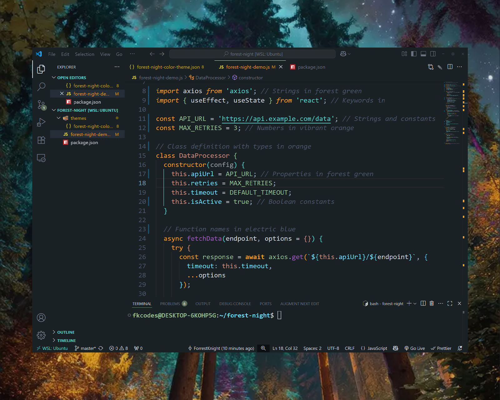

# Forest Night

Forest Night is a dark, nature-inspired color scheme for Visual Studio Code with hints of ethereal magic and cosmic mystery. This theme brings the serene ambiance of a moonlit forest to your coding environment, featuring deep greens, warm earth tones, and gentle mystical highlights that transform your workspace into a tranquil sanctuary under the stars.

## Installation

1. Press the extensions icon in your Visual Studio Code sidebar
2. Search for "Forest Night" by forrest-knight
3. Click Install
4. Press `Ctrl+Shift+P` (or `Cmd+Shift+P` on Mac) to open the command palette
5. Type "Color Theme" and select "Preferences: Color Theme"
6. Select "Forest Night" from the list

## Usage

Once installed, switch to the "Forest Night" theme by:

1. Opening the Command Palette (`Ctrl+Shift+P` or `Cmd+Shift+P`)
2. Typing "Color Theme"
3. Selecting "Preferences: Color Theme"
4. Choosing "Forest Night" from the themes

## Contributing

Contributions are welcome, kind of (I'm very particular). Submit issues or pull requests on [GitHub](https://github.com/ForrestKnight/forest-night-theme/issues).

## License

MIT License
